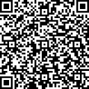

# 🚗 Symcon Car API VW

Ein schlankes IP-Symcon-Modul zum direkten Abruf von Fahrzeugdaten der **Volkswagen CarConnectivity API**.  
Unterstützt VW, Audi, Skoda, Seat und Cupra – **ohne Docker, NodeJS oder externe Hilfstools**, rein über HTTPS.

---

## ✅ Funktionen

- Direkter Login zur offiziellen CarConnectivity API (Benutzername + Passwort)
- Unterstützung mehrerer Marken:
  - Volkswagen
  - Audi
  - Skoda
  - Seat
  - Cupra
- Fahrzeugauswahl per VIN
- Abruf von:
  - 🔋 Ladezustand (SoC)
  - 🚗 Reichweite
  - 🔌 Ladezustand (Steckstatus, Ladevorgang)
  - ❄ Außentemperatur (sofern verfügbar)
- Saubere Integration in IP-Symcon
- Keine zusätzlichen Container, Server oder Dienste nötig

---

## 🛠 Voraussetzungen

- IP-Symcon ab Version 6.x
- Gültiger Volkswagen-CarConnectivity-Account (oder Skoda, Audi, etc.)
- Fahrzeug muss in der jeweiligen Hersteller-App registriert sein

---

## 🔧 Installation

1. Modul im IP-Symcon über das **Module Control** hinzufügen:
https://github.com/pesensie/symcon-car-api-vw

2. Instanz anlegen und Zugangsdaten + Fahrzeugmarke hinterlegen
3. VIN manuell eintragen oder aus Fahrzeugliste abrufen lassen
4. Fertig – Fahrzeugdaten werden regelmäßig abgerufen und in Variablen geschrieben

---

## 💡 Lizenz

Dieses Projekt steht unter der [MIT-Lizenz](LICENSE).

---

## ❤️ Unterstützung

Du möchtest die Weiterentwicklung unterstützen? Wir freuen uns über eine kleine Spende:

<table>
  <tr>
    <td align="center">
      
    </td>
    <td align="center">
      
    </td>
  </tr>
</table>

> ☕ Vielen Dank für deine Unterstützung!  
> 📜 Dieses Modul bleibt selbstverständlich frei verfügbar und quelloffen.

---

## 📝 Copyright

© 2025 Siegfried Pesendorfer  
Dieses Projekt steht in keiner Verbindung zur Volkswagen AG oder verbundenen Unternehmen. Die Nutzung der API erfolgt auf eigene Verantwortung.

---
